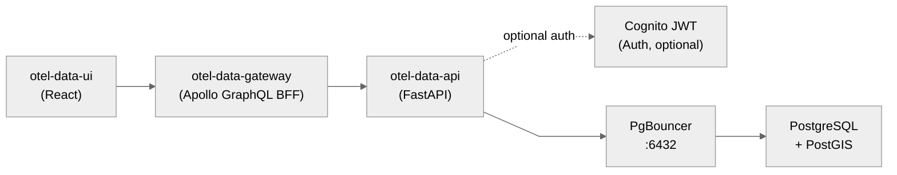

# OTel Data API

[](https://github.com/stuartshay/otel-data-api/actions/workflows/lint.yml)
[](https://github.com/stuartshay/otel-data-api/actions/workflows/docker.yml)
[](https://github.com/stuartshay/otel-data-api/actions/workflows/publish-types.yml)
[](https://hub.docker.com/repository/docker/stuartshay/otel-data-api)
[](https://www.npmjs.com/package/@stuartshay/otel-data-types)
[](https://www.python.org/)
[](https://fastapi.tiangolo.com/)

FastAPI microservice providing read/write access to the OwnTracks + Garmin
location database with PostGIS spatial queries.

## Architecture



## Features

- **OwnTracks Locations** — Query, filter, and paginate GPS location data
- **Garmin Activities** — Access cycling/running activities and track points
- **Unified GPS View** — Combined OwnTracks + Garmin data via database views
- **Daily Summaries** — Aggregated daily activity statistics
- **Reference Locations** — CRUD for named locations (home, work, gym)
- **PostGIS Spatial** — Nearby points, distance calculations, geofencing
- **Cognito JWT Auth** — OAuth2 authentication for write operations
- **OpenTelemetry** — Distributed tracing instrumentation

## Endpoints

| Method | Path | Description |
|--------|------|-------------|
| GET | `/health` | Liveness check |
| GET | `/ready` | Readiness check (DB) |
| GET | `/api/v1/locations` | List locations (paginated) |
| GET | `/api/v1/locations/devices` | List devices |
| GET | `/api/v1/locations/count` | Location counts by device |
| GET | `/api/v1/locations/{id}` | Get location detail |
| GET | `/api/v1/garmin/activities` | List Garmin activities |
| GET | `/api/v1/garmin/sports` | List sport types |
| GET | `/api/v1/garmin/activities/{id}` | Activity detail |
| GET | `/api/v1/garmin/activities/{id}/tracks` | Track points |
| GET | `/api/v1/gps/unified` | Unified GPS points (view) |
| GET | `/api/v1/gps/daily-summary` | Daily activity summary |
| GET | `/api/v1/reference-locations` | List reference locations |
| GET | `/api/v1/reference-locations/{id}` | Get reference location |
| POST | `/api/v1/reference-locations` | Create (auth required) |
| PUT | `/api/v1/reference-locations/{id}` | Update (auth required) |
| DELETE | `/api/v1/reference-locations/{id}` | Delete (auth required) |
| GET | `/api/v1/spatial/nearby` | Find nearby GPS points |
| GET | `/api/v1/spatial/distance` | Distance between points |
| GET | `/api/v1/spatial/within-reference/{name}` | Points within reference |

## Quick Start

```bash
# Setup environment
./setup.sh

# Activate virtual environment
source venv/bin/activate

# Start development server
make dev

# View API docs
open http://localhost:8080/docs
```

## Development

### Prerequisites

- Python 3.12+
- PostgreSQL with PostGIS (via PgBouncer)
- Docker (optional)

### Setup

```bash
# Clone repository
git clone https://github.com/stuartshay/otel-data-api.git
cd otel-data-api

# Run setup
./setup.sh

# Edit .env with your database credentials
vim .env

# Start development server
source venv/bin/activate
make dev
```

### Commands

```bash
make help          # Show all commands
make dev           # Start dev server (auto-reload)
make start         # Start in background
make stop          # Stop background server
make test          # Run tests
make lint          # Run ruff linter
make format        # Format code
make type-check    # Run mypy
make check         # Run all checks
make db-test       # Test database connection
make docker-build  # Build Docker image
```

### Testing

```bash
# Run all tests
make test

# Run with coverage
make test-cov

# Run specific test file
pytest tests/test_health.py -v
```

Coverage is enforced with a minimum 85% line coverage for `app/` (configured in `pyproject.toml`).

## Docker

```bash
# Build
docker build -t stuartshay/otel-data-api .

# Run
docker run -p 8080:8080 --env-file .env stuartshay/otel-data-api

# Or use make
make docker-build
make docker-run
```

## Environment Variables

| Variable | Default | Description |
|----------|---------|-------------|
| `PGBOUNCER_HOST` | `192.168.1.175` | PgBouncer host |
| `PGBOUNCER_PORT` | `6432` | PgBouncer port |
| `POSTGRES_DB` | `owntracks` | Database name |
| `POSTGRES_USER` | `development` | Database user |
| `POSTGRES_PASSWORD` | `development` | Database password |
| `DB_POOL_MIN` | `2` | Min connection pool |
| `DB_POOL_MAX` | `10` | Max connection pool |
| `PORT` | `8080` | Server port |
| `OAUTH2_ENABLED` | `false` | Enable Cognito auth |
| `COGNITO_ISSUER` | — | Cognito issuer URL |
| `COGNITO_CLIENT_ID` | — | Cognito client ID |
| `CORS_ORIGINS` | `*` | Allowed CORS origins |
| `OTEL_SERVICE_NAME` | `otel-data-api` | OTel service name |
| `NEW_RELIC_LICENSE_KEY` | — | New Relic license key (optional) |
| `NEW_RELIC_APP_NAME` | `otel-data-api` | New Relic application name |
| `NEW_RELIC_APPLICATION_LOGGING_ENABLED` | `true` | Enable NR log collection |
| `NEW_RELIC_APPLICATION_LOGGING_FORWARDING_ENABLED` | `true` | Forward logs to NR |
| `NEW_RELIC_LOG` | `stdout` | NR agent log destination |
| `NEW_RELIC_DISTRIBUTED_TRACING_ENABLED` | `true` | Enable distributed tracing |

## Database Schema

The API reads from these tables managed by
[homelab-database-migrations](https://github.com/stuartshay/homelab-database-migrations):

- `public.locations` — OwnTracks GPS data
- `public.garmin_activities` — Garmin Connect activities
- `public.garmin_track_points` — Garmin GPS track points
- `public.reference_locations` — Named reference locations
- `unified_gps_points` (view) — Combined GPS data
- `daily_activity_summary` (view) — Aggregated daily stats

## Related Repositories

- [otel-data-ui](https://github.com/stuartshay/otel-data-ui) — React frontend (primary consumer)
- [otel-data-gateway](https://github.com/stuartshay/otel-data-gateway) — Apollo Server GraphQL BFF
- [otel-ui](https://github.com/stuartshay/otel-ui) — React frontend (legacy)
- [otel-demo](https://github.com/stuartshay/otel-demo) — Flask API (legacy)
- [otel-worker](https://github.com/stuartshay/otel-worker) — Go gRPC distance calculator
- [k8s-gitops](https://github.com/stuartshay/k8s-gitops) — Kubernetes deployment
- [homelab-database-migrations](https://github.com/stuartshay/homelab-database-migrations) — Database schema
